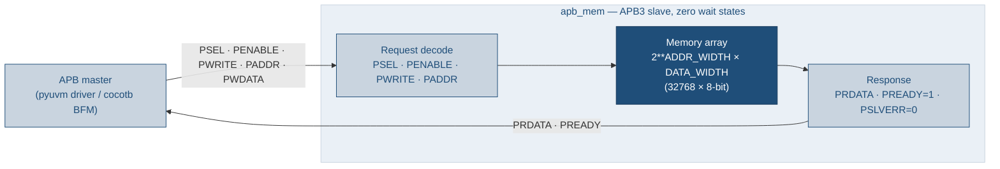
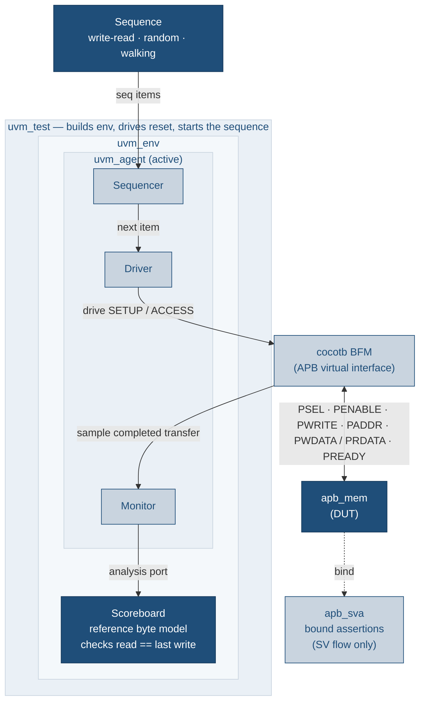
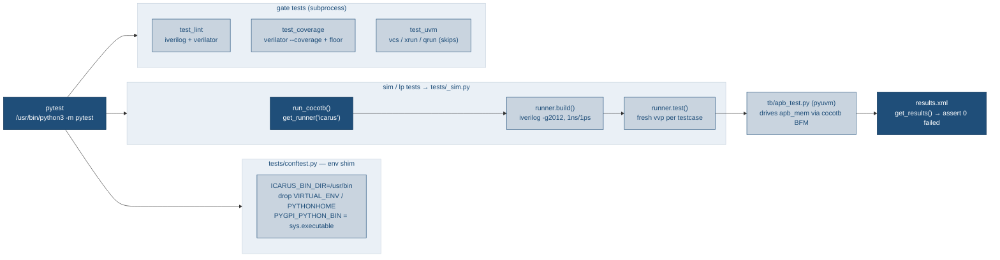

# apb-to-mem-all-py

APB byte-wide 32K memory RTL with a self-checking PyUVM testbench, driven
entirely by **pytest** instead of GNU Make. This repo is a derivative of
[`uvm_review`](../uvm_review): same RTL, same cocotb/pyuvm testbench, same
low-power / lint / coverage / UVM deliverables — but the Makefile orchestration
is replaced by pytest tests that call cocotb's Python runner API.

## Architecture

`apb_mem` is a zero-wait-state APB3 slave wrapping a byte-wide memory array
(`2**ADDR_WIDTH` locations of `DATA_WIDTH` bits; default 32768 × 8-bit = 32K).
`PREADY` is tied high so every transfer completes in the ACCESS phase and
`PSLVERR` is tied low; writes are gated by `PRESETn`, and the array powers up
all-zero so reads of un-written locations return 0.



The testbench is a layered pyuvm environment; only the BFM touches DUT signals,
and the scoreboard keeps a reference byte model that checks every read against
the last write to that address. The bound `apb_sva` assertions run in the SV/UVM
flow only.



## Why pytest

The source repo hand-rolled a `run_one_test` Make recipe to run **one cocotb
test per simulation** (the RTL only zeroes its array at time 0, so sharing a sim
across tests causes a seed-dependent scoreboard flake). Pytest gives this for
free: each test function calls `cocotb.runner` once, spawning its own `vvp`
process with a fresh, time-0-zeroed memory. See `tests/_sim.py`.



## Requirements

- **Icarus Verilog 11** at `/usr/bin/iverilog` (apt package). The cocotb VPI must
  be built with the interpreter that imports the testbench; `tests/conftest.py`
  pins `ICARUS_BIN_DIR=/usr/bin` so the apt Icarus is used even when an
  OSS-CAD-Suite `iverilog` shadows it on `PATH`.
- **Python 3.10** — the same interpreter for both pytest and the sim. Install the
  deps into it (on this workstation that is `/usr/bin/python3`):

  ```bash
  sudo /usr/bin/python3 -m pip install -r requirements-dev.txt
  ```
- **Verilator** (optional) — enables the lint and coverage gates; both skip
  cleanly when it is absent.
- A UVM simulator (VCS / Xcelium / Questa) is only needed for `-m uvm`, which
  otherwise skips.

Run pytest with that interpreter, e.g. `/usr/bin/python3 -m pytest`.

## Directory layout

- `rtl/apb_mem.sv` — the DUT
- `tb/` — PyUVM testbench + cocotb `@cocotb.test` entry points (copied verbatim)
- `lp/` — low-power / UPF example (golden `apb_mem.upf` + runnable emulation)
- `sim/sim_main.cpp` — Verilator C++ coverage harness
- `uvm/` — mirror SystemVerilog UVM testbench (reference; license-gated)
- `tests/` — the pytest layer (this is what replaces the Makefiles)
- `pyproject.toml` — pytest config + marker registry

## `make` → `pytest` mapping

An **optional** `Makefile` wrapper restores the familiar `make` verbs — each just
shells out to the pytest command in the right column (nothing runs without
pytest). Use it (`make test`, `make lint`, `make ci`, …; `make help` lists all)
or call pytest directly, whichever you prefer. Override the interpreter with
`make PYTHON=... <target>` and pass extra pytest flags via `ARGS="..."`.

| Old Make target | pytest command |
|---|---|
| `make test` / `make test-all` | `pytest -m sim` |
| `make test-write-read` | `pytest tests/test_functional.py -k write_read` |
| `make test-random` | `pytest tests/test_functional.py -k random` |
| `make test-walking` | `pytest tests/test_functional.py -k walking` |
| `make lp` | `pytest -m lp` |
| `make lint` | `pytest -m lint` |
| `make coverage` | `pytest -m coverage` |
| `make uvm` | `pytest -m uvm` (skips without a UVM simulator) |
| `make check` | `pytest -m "lint or sim"` |
| `make regress` | `pytest -m "lint or sim or lp"` |
| `make ci` | `pytest` (runs everything; `uvm` self-skips) |
| `make waves TEST=x` | `pytest tests/test_functional.py -k x --waves` |
| `make clean` | `git clean -fdX` (build artifacts are gitignored) |

`COV_MIN=<n> pytest -m coverage` overrides the 100% line-coverage floor, matching
`make coverage COV_MIN=<n>`. `UVM_TEST=<name> pytest -m uvm` picks the UVM test.

## Waveforms

`--waves` dumps an FST per test into `tests/sim_build/<testcase>/`:

```bash
/usr/bin/python3 -m pytest tests/test_functional.py -k random --waves
gtkwave tests/sim_build/random_test/apb_mem.fst tb/apb_mem.gtkw
```

## CI

`.github/workflows/ci.yml` installs Icarus + Verilator + the Python deps and runs
`pytest -ra` (the `make ci` equivalent), then uploads `sim/coverage.info`.
