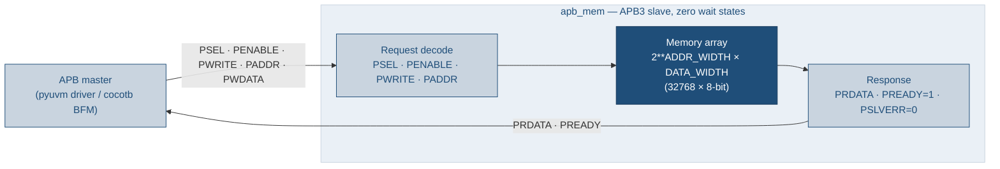
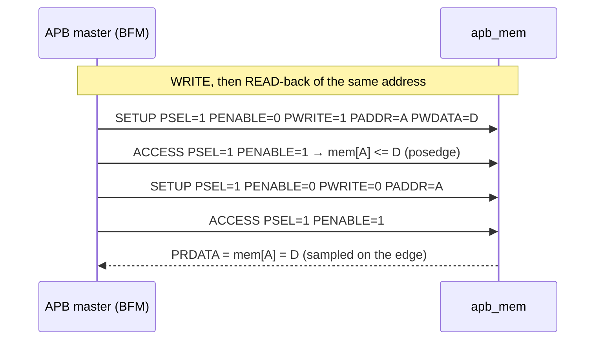
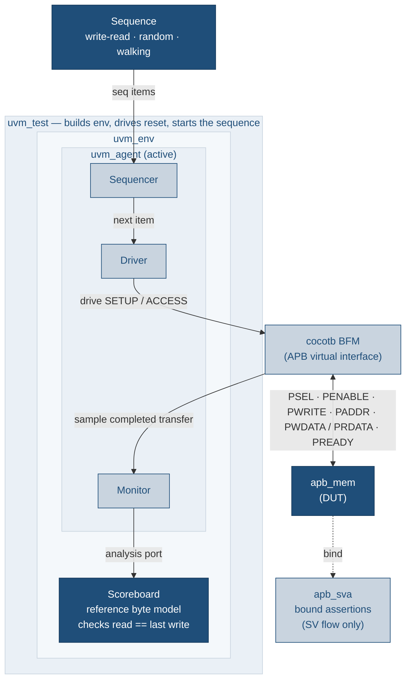
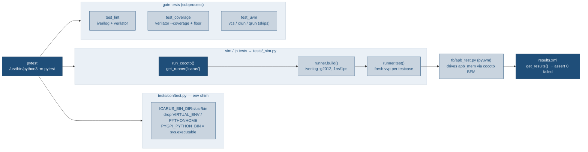

# apb-to-mem-all-py

APB byte-wide 32K memory RTL with a self-checking PyUVM testbench, driven
entirely by **pytest** instead of GNU Make. This repo is a derivative of
[`uvm_review`](../uvm_review): same RTL, same cocotb/pyuvm testbench, same
low-power / lint / coverage / UVM deliverables — but the Makefile orchestration
is replaced by pytest tests that call cocotb's Python runner API, with pytest
markers standing in for the make targets.

New here? [`docs/TUTORIAL.md`](docs/TUTORIAL.md) is a hands-on walk through running
the gates and extending the testbench (with a full "add your own test" example).
[`CLAUDE.md`](CLAUDE.md) is the terse orientation for agents/contributors.

## At a glance

| | |
|---|---|
| **DUT** | `apb_mem` — APB3 slave, 32768 × 8-bit array, zero wait states, never errors |
| **Testbench** | layered pyuvm over a cocotb BFM; reference-model scoreboard |
| **Simulator** | Icarus Verilog 11 (functional), Verilator (lint + coverage) |
| **Orchestration** | pytest + cocotb's Python runner (`cocotb.runner`); no Makefiles required |
| **Gates** | 3 functional tests · lint · coverage · low-power · UVM (skips w/o a license) |
| **Health check** | `pytest` ⇒ **7 passed, 1 skipped** (the UVM gate self-skips) — verified 2026-08-05 |
| **CI** | GitHub Actions → `pytest -ra`, uploads `sim/coverage.info` |

## Architecture

`apb_mem` is a zero-wait-state APB3 slave wrapping a byte-wide memory array
(`2**ADDR_WIDTH` locations of `DATA_WIDTH` bits; default 32768 × 8-bit = 32K).
`PREADY` is tied high so every transfer completes in the ACCESS phase and
`PSLVERR` is tied low; writes are gated by `PRESETn`, and the array powers up
all-zero so reads of un-written locations return 0.



### DUT interface (`rtl/apb_mem.sv`)

Parameters: `ADDR_WIDTH = 15` (⇒ `DEPTH = 2**15 = 32768`), `DATA_WIDTH = 8`.

| Signal | Dir | Width | Role |
|---|---|---|---|
| `PCLK` | in | 1 | Bus clock; the array write is `posedge`-clocked |
| `PRESETn` | in | 1 | Active-low reset; gates writes (no write while low) |
| `PSEL` | in | 1 | Slave select — starts a transfer |
| `PENABLE` | in | 1 | 0 in SETUP, 1 in ACCESS (the second phase) |
| `PWRITE` | in | 1 | 1 = write, 0 = read |
| `PADDR` | in | 15 | Byte address (`0x0000`–`0x7FFF`) |
| `PWDATA` | in | 8 | Write payload |
| `PRDATA` | out | 8 | Read data — combinational, valid throughout ACCESS |
| `PREADY` | out | 1 | Tied **high** (zero wait states) |
| `PSLVERR` | out | 1 | Tied **low** (never errors; coverage-waived) |

### APB transfer phases

Every transfer is exactly two clocks: SETUP then ACCESS. Because `PREADY` is
tied high, ACCESS never extends.

| Phase | `PSEL` | `PENABLE` | `PREADY` | What happens |
|---|:---:|:---:|:---:|---|
| IDLE | 0 | 0 | 1 | Bus quiet |
| SETUP | 1 | 0 | 1 | Address/control driven; nothing commits yet |
| ACCESS | 1 | 1 | 1 | Write commits on this edge; read `PRDATA` sampled here |



The testbench is a layered pyuvm environment; only the BFM touches DUT signals,
and the scoreboard keeps a reference byte model that checks every read against
the last write to that address. The bound `apb_sva` assertions run in the SV/UVM
flow only.



### Testbench components

| Component | File | Responsibility |
|---|---|---|
| `ApbSeqItem` | `tb/apb_seq_item.py` | one transfer (addr/data/write + captured `rdata`); `__eq__`/`__str__` |
| Sequences | `tb/apb_seq.py` | `ApbWriteReadSeq`, `ApbRandomSeq`, `ApbWalkingSeq` |
| `ApbDriver` | `tb/apb_components.py` | pulls items, calls the BFM, returns read data |
| `ApbMonitor` | `tb/apb_components.py` | watches the bus, publishes observed transfers |
| `ApbScoreboard` | `tb/apb_components.py` | reference `dict` model; asserts `read == last write` |
| `ApbAgent`/`ApbEnv` | `tb/apb_components.py` | wiring (sequencer↔driver, monitor→scoreboard) |
| `ApbBfm` | `tb/apb_bfm.py` | **only** pin-level code; two-phase APB drive + monitor coroutines |
| Tests | `tb/apb_test.py` | `uvm_test`s + the `@cocotb.test` entry points |

## Why pytest

The source repo hand-rolled a `run_one_test` Make recipe to run **one cocotb
test per simulation** (the RTL only zeroes its array at time 0, so sharing a sim
across tests causes a seed-dependent scoreboard flake). Pytest gives this for
free: each test function calls `cocotb.runner` once, spawning its own `vvp`
process with a fresh, time-0-zeroed memory. See `tests/_sim.py`.



### The pytest layer (what replaces the Makefiles)

| Symbol | File | What it does |
|---|---|---|
| `run_cocotb(...)` | `tests/_sim.py` | build+run one `@cocotb.test` under Icarus, then `assert failed == 0` |
| env shim | `tests/conftest.py` | pins `ICARUS_BIN_DIR`, drops `VIRTUAL_ENV`/`PYTHONHOME`, binds `PYGPI_PYTHON_BIN` — at import time, before any build |
| `_pinned_icarus_on_path` | `tests/_sim.py` | front-loads the apt Icarus on `PATH` only around the runner call (so it doesn't shadow Verilator) |
| `--waves` option / `waves` fixture | `tests/conftest.py` | opt-in FST dump per testcase |
| markers | `pyproject.toml` | `sim` / `lp` / `lint` / `coverage` / `uvm` — the `pytest -m` selectors that stand in for make targets |

## Requirements

- **Icarus Verilog 11** at `/usr/bin/iverilog` (apt package). The cocotb VPI must
  be built with the interpreter that imports the testbench; `tests/conftest.py`
  pins `ICARUS_BIN_DIR=/usr/bin` so the apt Icarus is used even when an
  OSS-CAD-Suite `iverilog` shadows it on `PATH`.
- **Python 3.10** with **cocotb 1.9.2 + pyuvm 4.0.1** — the same interpreter for
  both pytest and the sim. Install the deps into it (on this workstation that is
  `/usr/bin/python3`):

  ```bash
  sudo /usr/bin/python3 -m pip install -r requirements-dev.txt
  ```
- **Verilator** (optional) — enables the lint and coverage gates; both skip
  cleanly when it is absent.
- A UVM simulator (VCS / Xcelium / Questa) is only needed for `-m uvm`, which
  otherwise skips.

Run pytest with that interpreter, e.g. `/usr/bin/python3 -m pytest`.

> **Version pins matter.** The tests target cocotb 1.9.2 + pyuvm 4.0.1 on Python
> 3.10. If an OSS-CAD-Suite Python (cocotb 2.x) is first on `PATH`, run pytest
> with the explicit interpreter (`/usr/bin/python3 -m pytest`) — cocotb's VPI and
> the pytest process must be the *same* interpreter. See [CLAUDE.md](CLAUDE.md).

## Markers & the `make` → `pytest` mapping

An **optional** `Makefile` wrapper restores the familiar `make` verbs — each just
shells out to the pytest command in the right column (nothing runs without
pytest). Use it (`make test`, `make lint`, `make ci`, …; `make help` lists all)
or call pytest directly, whichever you prefer. Override the interpreter with
`make PYTHON=... <target>` and pass extra pytest flags via `ARGS="..."`.

| Old Make target | pytest command | Marker | Skips when… |
|---|---|---|---|
| `make test` / `make test-all` | `pytest -m sim` | `sim` | — |
| `make test-write-read` | `pytest tests/test_functional.py -k write_read` | `sim` | — |
| `make test-random` | `pytest tests/test_functional.py -k random` | `sim` | — |
| `make test-walking` | `pytest tests/test_functional.py -k walking` | `sim` | — |
| `make lp` | `pytest -m lp` | `lp` | — |
| `make lint` | `pytest -m lint` | `lint` | Verilator part skips w/o Verilator |
| `make coverage` | `pytest -m coverage` | `coverage` | whole gate skips w/o Verilator |
| `make uvm` | `pytest -m uvm` | `uvm` | skips w/o vcs/xrun/qrun |
| `make check` | `pytest -m "lint or sim"` | — | — |
| `make regress` | `pytest -m "lint or sim or lp"` | — | — |
| `make ci` | `pytest` (runs everything; `uvm` self-skips) | — | uvm/coverage skip per above |
| `make waves TEST=x` | `pytest tests/test_functional.py -k x --waves` | `sim` | — |
| `make clean` | `git clean -fdX` (build artifacts are gitignored) | — | — |

`COV_MIN=<n> pytest -m coverage` overrides the 100% line-coverage floor, matching
`make coverage COV_MIN=<n>`. `UVM_TEST=<name> pytest -m uvm` picks the UVM test.

### The three functional sequences

| Sequence | Test / cocotb testcase | Stimulus |
|---|---|---|
| `ApbWriteReadSeq` | `WriteReadTest` / `write_read_test` | 32× write a random byte, then read the same address back |
| `ApbRandomSeq` | `RandomTest` / `random_test` | 64× random R/W; reads biased 4:1 to already-written addresses |
| `ApbWalkingSeq` | `WalkingTest` / `walking_test` | directed: `{0x0000,0x0001,0x7FFE,0x7FFF}` × `{0x00,0x01,0x55,0xAA,0xFF}` |

Each is selected as a pytest parameter id in `tests/test_functional.py`
(`pytest -k write_read` / `-k random` / `-k walking`).

## Repository layout

| Path | Contents |
|---|---|
| `rtl/apb_mem.sv` | the DUT |
| `tb/*.py` | pyuvm/cocotb testbench (bfm, components, sequences, items, tests) + `apb_mem.gtkw` layout |
| `tests/*.py` | the pytest layer — this is what replaces the Makefiles |
| `tests/_sim.py` | shared cocotb-runner helper (`run_cocotb`) |
| `tests/conftest.py` | env shim + `--waves` option |
| `uvm/*.sv` | SystemVerilog/UVM flow + bound `apb_sva` assertions |
| `lp/` | low-power UPF variant (`apb_mem_lp.sv`, `apb_mem_array.sv`, `apb_mem.upf`, `test_lp.py`) |
| `sim/sim_main.cpp` | Verilator coverage harness |
| `pyproject.toml` | pytest config + marker registry |
| `Makefile` | optional `make` → `pytest` shim |
| `docs/TUTORIAL.md` | hands-on guide |

## Low-power (UPF) demo — `pytest -m lp`

`lp/apb_mem_lp.sv` splits the storage array into a switchable child instance
(power domain `PD_MEM`) so the design can demonstrate an IEEE-1801 (UPF) flow —
a power switch, an isolation strategy, and a retention strategy — whose golden
intent lives in `lp/apb_mem.upf`. Because the repo's simulators are not
UPF-aware, the control signals and clamp cells are **hand-modeled** behind
`` `ifdef LP_EMULATE `` (`tests/test_lowpower.py` compiles with `LP_EMULATE=1`).
`lp/test_lp.py` drives one `power_cycle_test` proving:

| Step | Property | Check |
|---|---|---|
| 1 | powered-on read-back | pattern written, reads back correctly |
| 2 | isolation | while off, `PREADY=0` and `PRDATA` clamps to `0` (never X on the AON boundary) |
| 3 | retention | power cycle with `ret=1` preserves contents |
| 4 | corruption | power cycle with `ret=0` loses them (reads back X) — proves retention did real work |
| 5 | recovery | array is writable again after re-init |

## SV/UVM flow & assertions — `pytest -m uvm`

The `uvm/` tree is a full SystemVerilog UVM testbench compiled/run only by
`pytest -m uvm` on a licensed host (VCS/Xcelium/Questa); it skips cleanly
otherwise. `uvm/apb_sva.sv` is a standalone checker `bind`-ed to every `apb_mem`
instance, so it needs no DUT/TB changes. It runs in the SV flow only (Icarus has
weak SVA support).

| Assertion | Rule |
|---|---|
| `a_enable_needs_sel` | `PENABLE |-> PSEL` |
| `a_setup_to_access` | a SETUP phase must advance to ACCESS next cycle |
| `a_enable_drops` | `PENABLE` drops the cycle after a completed ACCESS |
| `a_setup_stable` / `a_access_stable` | address/control held stable across the transfer |
| `a_wdata_stable_setup` / `a_access_wdata_stable` | `PWDATA` held stable on writes |
| `a_pready_tied_high` | `PSEL |-> PREADY` (this slave's zero-wait tie-off) |
| `a_pslverr_low` | `PSLVERR` never asserts |
| `a_known_ctrl` / `a_known_wdata` / `a_known_rdata` | no X on control/data when active |
| `a_reset_idle` | outputs idle during reset |
| `c_write` / `c_read` | cover: a write / a read completed |

## Waveforms

`--waves` dumps an FST per test into `tests/sim_build/<testcase>/`:

```bash
/usr/bin/python3 -m pytest tests/test_functional.py -k random --waves
gtkwave tests/sim_build/random_test/apb_mem.fst tb/apb_mem.gtkw
```

`make wave TEST=random_test` does both steps (dump then open) and skips cleanly
if GTKWave is not installed.

## CI

`.github/workflows/ci.yml` runs on every push to `main` and every pull request:


`uvm` self-skips on the runner (no UVM license); everything else runs. The lcov
`sim/coverage.info` is uploaded as the `coverage-info` artifact.
